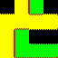
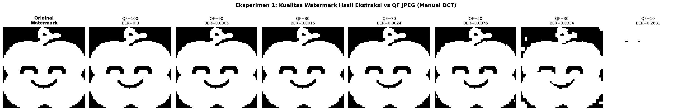
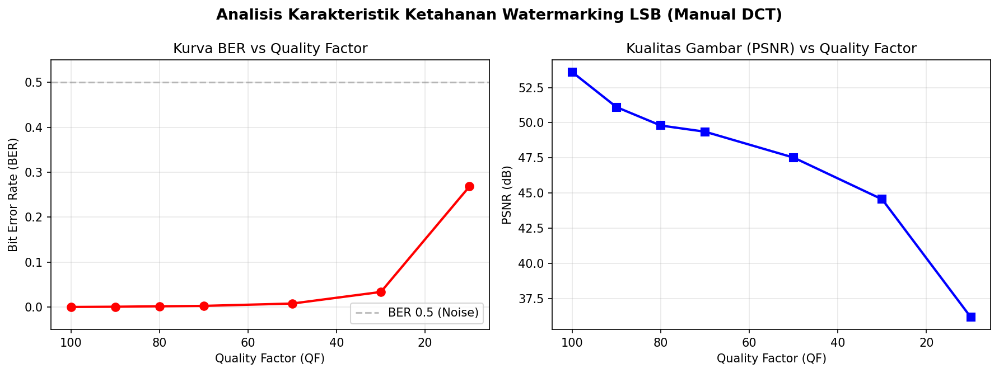
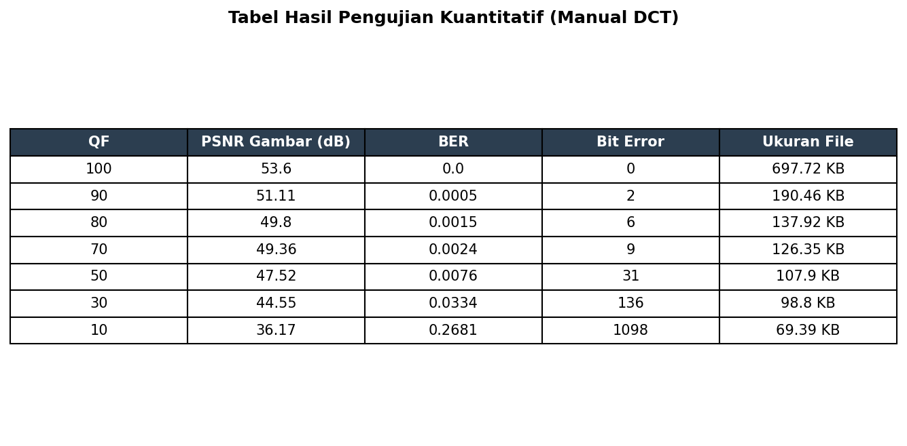

# Tugas Sistem Multimedia - Watermarking

**Dipersiapkan oleh:**
Anisa Aulia Alhaqi | 18224080@std.stei.itb.ac.id

---

## 01 — Teori Singkat

### 1.1 Kompresi JPEG

JPEG (Joint Photographic Experts Group) adalah standar kompresi citra lossy yang bekerja dengan membuang informasi detail frekuensi tinggi. Prosesnya meliputi:

1. Pembagian citra menjadi blok 8x8.
2. Transformasi DCT (Discrete Cosine Transform).
3. Kuantisasi menggunakan Q-Table (berdasarkan Quality Factor).
4. Inverse DCT untuk rekonstruksi piksel.

Semakin kecil nilai QF, semakin banyak data yang dibuang, menghasilkan ukuran file kecil namun kualitas menurun.

### 1.2 Watermarking Digital

Teknik menyisipkan informasi tersembunyi ke media digital. Kriteria utama:

- **Imperceptibility**: Tidak merusak kualitas visual (tidak terlihat mata).
- **Robustness**: Tahan terhadap manipulasi seperti kompresi JPEG atau filter.

### 1.3 Metode LSB Klasik vs Robust LSB

- **LSB Klasik**: Mengganti bit ke-0. Sangat rapuh terhadap kompresi karena bit rendah adalah yang pertama dibuang oleh kuantisasi.
- **Robust LSB**: Menyisipkan pada bit-plane lebih tinggi (misal Bit-3) dan menggunakan redundansi (seperti *majority voting*) agar data tetap bisa dipulihkan meski terjadi distorsi piksel.

---

## 02 — Perancangan dan Implementasi

Sistem ini menyisipkan citra biner (logo) ke dalam citra berwarna (wajah) dengan optimasi agar tahan terhadap kompresi JPEG QF rendah.

### 2.1 Kronologi Pengembangan

Metode final ditemukan melalui tiga tahap eksperimen:

#### 2.1.1 Eksperimen Full Color LSB

Watermark berwarna disisipkan pada Bit-0 kanal RGB. Hasilnya: watermark hancur total setelah kompresi JPEG karena bit-0 langsung terhapus oleh kuantisasi DCT.

|                Hasil Ekstraksi Exp 1 (Gagal)                |
| :----------------------------------------------------------: |
|  |
|          *Watermark berubah menjadi noise visual*          |

#### 2.1.2 Eksperimen Grayscale LSB

Host dan watermark diubah ke grayscale. Hasil ekstraksi jelas, namun foto host kehilangan seluruh warna (menjadi hitam-putih), yang tidak ideal untuk sistem multimedia modern.

|                       Hasil Embedding Exp 2                       |
| :---------------------------------------------------------------: |
|  |
|                      *Warna hilang total*                      |

#### 2.1.3 Eksperimen Color Host dan Binary Watermark (Final)

Solusi optimal: Host tetap berwarna (RGB), namun watermark dikonversi menjadi biner. Teknik *majority voting* 3x3 diterapkan pada kanal Hijau di Bit-3.

### 2.2 Optimasi Robustness (Technical Details)

Untuk menjamin watermark tahan terhadap serangan kompresi, dilakukan tiga teknik optimasi utama:

1. **Target Kanal Hijau (Green Channel)**:
   Berdasarkan standar ITU-R BT.601, konversi warna ke Luminans (Y) menggunakan bobot:

   $$
   Y = 0.299R + 0.587G + 0.114B
   $$

   Kanal Hijau memberikan kontribusi terbesar ($58.7\%$) terhadap struktur gambar yang dilihat mata. Algoritma JPEG sangat menjaga integritas komponen Luminans dibanding Krominan, sehingga penyisipan pada kanal Hijau jauh lebih stabil.
2. **Bit-Plane Shifting (Bit-3)**:
   Kuantisasi JPEG bekerja seperti filter *low-pass* yang membuang variasi nilai kecil. Bit-0 (LSB klasik) hanya merepresentasikan nilai $2^0 = 1$, yang hampir pasti hilang saat pembulatan DCT. Dengan berpindah ke Bit-3 ($2^3 = 8$), kita memberikan "jarak" yang cukup besar sehingga perubahan nilai akibat kuantisasi tidak sampai membalikkan (flip) nilai bit tersebut secara permanen.
3. **3x3 Majority Voting (Spatial Redundancy)**:
   Satu bit watermark disebar ke dalam blok berukuran $3 \times 3$ (9 piksel). Pada tahap ekstraksi, algoritma menghitung jumlah bit 1 di dalam blok tersebut:

   $$
   \text{Result} = \begin{cases} 1, & \text{jika } \sum_{i=1}^{9} \text{bit}_i \ge 5 \\ 0, & \text{jika } \sum_{i=1}^{9} \text{bit}_i < 5 \end{cases}
   $$

   Teknik ini memungkinkan sistem mengoreksi hingga 4 bit yang rusak dalam satu blok tanpa merusak informasi asli.

---

### 2.3 Implementasi Simulasi JPEG Manual

Sistem ini menggunakan implementasi DCT manual untuk mensimulasikan kerusakan data:

- **Transformasi**: Menggunakan *Discrete Cosine Transform* (DCT) 2D untuk memindahkan data dari domain spasial ke domain frekuensi.
- **Scaling Quality Factor**: Matriks kuantisasi standar ($Q_{table}$) diskalakan dengan faktor $S$ berdasarkan *Quality Factor* (QF) yang dipilih:
  - Jika $QF < 50: S = 5000 / QF$
  - Jika $QF \ge 50: S = 200 - 2 \times QF$
- **Kuantisasi**: Setiap koefisien DCT dibagi dengan $Q_{scaled} = \lfloor \frac{S \cdot Q_{table} + 50}{100} \rfloor$. Ini menyebabkan koefisien frekuensi tinggi menjadi nol, yang merupakan sumber utama hilangnya data watermark pada LSB klasik.

---

## 03 — Pengujian dan Analisis Hasil Program

### 3.1 Deskripsi Input dan Output Visual (Imperceptibility)
Salah satu syarat utama watermarking adalah *Imperceptibility* (tidak terlihat). Di bawah ini adalah perbandingan antara foto asli dan foto yang sudah disisipi data:

| Citra Host (Original) | Citra Ter-embed (Watermarked) |
| :---: | :---: |
|  |  |
| **PSNR: $\infty$** (Baseline) | **PSNR: 53.60 dB** |

**Analisis Visual:**
Dapat dilihat bahwa secara visual, kedua gambar di atas **identik**. Tidak ada artefak, perubahan warna, atau derau (*noise*) yang dapat ditangkap oleh mata manusia. Hal ini divalidasi dengan nilai **PSNR sebesar 53.60 dB**, di mana nilai di atas 30-40 dB sudah dianggap sangat baik dan tidak memiliki perbedaan visual yang berarti.

---

### 3.2 Input Watermark (Data Tersembunyi)
Data berikut adalah logo biner yang disisipkan secara tersebar ke dalam kanal hijau pada Bit-3 di seluruh area citra.

| Watermark (Original) |
| :---: |
|  |

---

### 3.3 Tabel Hasil Pengujian (Manual DCT)

Sistem diuji menggunakan simulasi kompresi JPEG manual dengan berbagai Quality Factor (QF).

|                    Hasil Ekstraksi per QF                    |
| :-----------------------------------------------------------: |
|  |

**Analisis Metrik:**

- **QF 100 - 50**: BER sangat rendah (< 1%). Watermark terekstrak hampir sempurna.
- **QF 30**: BER meningkat (~3.3%), namun watermark masih terbaca dengan sangat jelas secara visual.
- **QF 10**: BER mencapai ~26%. Watermark mulai terdistorsi parah namun pola dasar masih samar terlihat.

|      Grafik Analisis (BER vs PSNR)      |      Tabel Metrik Lengkap      |
| :-------------------------------------: | :----------------------------: |
|  |  |

### 3.3 Kesimpulan

Sistem Robust LSB ini terbukti efektif bertahan terhadap kompresi JPEG hingga level **QF 30**. Penggunaan redundansi spasial (Majority Voting) dan pemilihan bit-plane yang tepat (Bit-3) adalah kunci utama keberhasilan sistem dalam menyeimbangkan kualitas visual dan ketahanan data.

---

## 04 — Lampiran

- **Instalasi**:
  ```bash
  pip install -r requirements.txt
  python run_experiment.py
  ```
